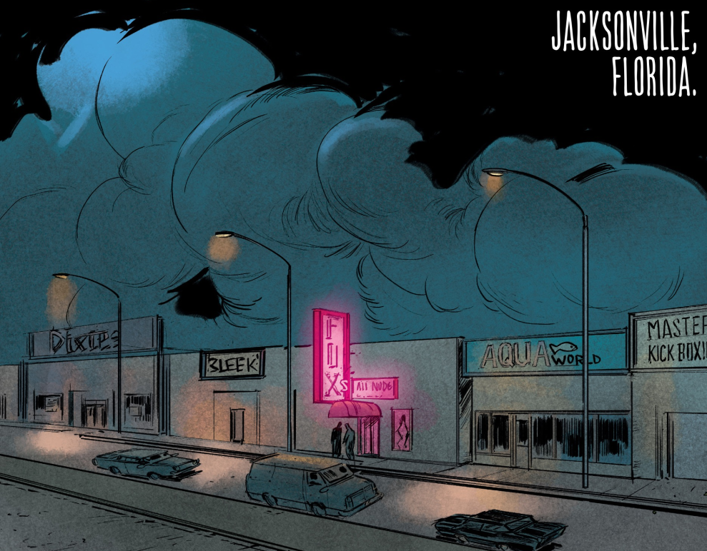
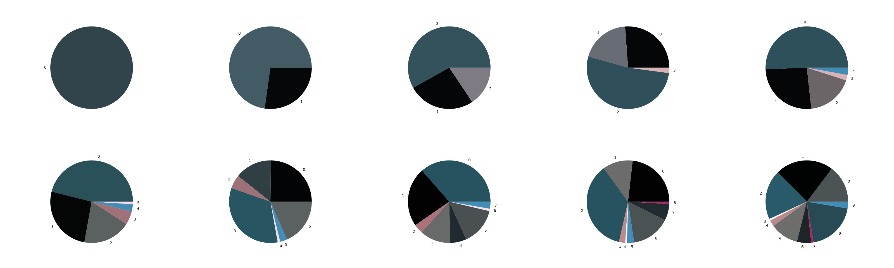

## Generative art from comic book color schemes
Generative art in `p5.js` using color schemes from comic books for explorative compositions.

### k-means-python
Python tool for performing k-means clustering on images. `app.py` takes a directory of images `IMAGES_DIRECTORY` (default is `data/images`) and performs k-means clustering for 1-10 clusters on each image. Pie charts of chosen centroid colors for each image are saved to `PLOTS_DIRECTORY` (default is `data/plots`).

#### Input image


#### Fitted color clusters


#### Setup (clone repo, activate virtual environment, install dependencies):

```
git clone https://github.com/MerkleBros/generative-art-from-comic-color-schemes.git && \
cd generative-art-from-comic-color-schemes/python/k-means-python && \
python3 -m venv venv && \
source venv/bin/activate && \
pip install pip-tools && \
pip-sync requirements.txt
```

#### Usage
- Place images for k-means clustering into `data/images` or update `IMAGES_DIRECTORY` to your image directory
- (Optional) Update `PLOTS_DIRECTORY` to save pie charts somewhere besides the default directory `data/plots`
- `python3 app.py` will perform k-means clustering and generate centroid pie charts for each image
